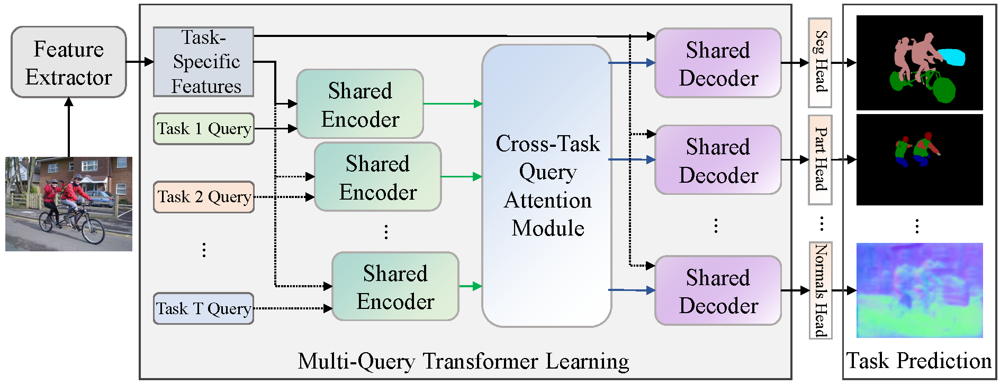
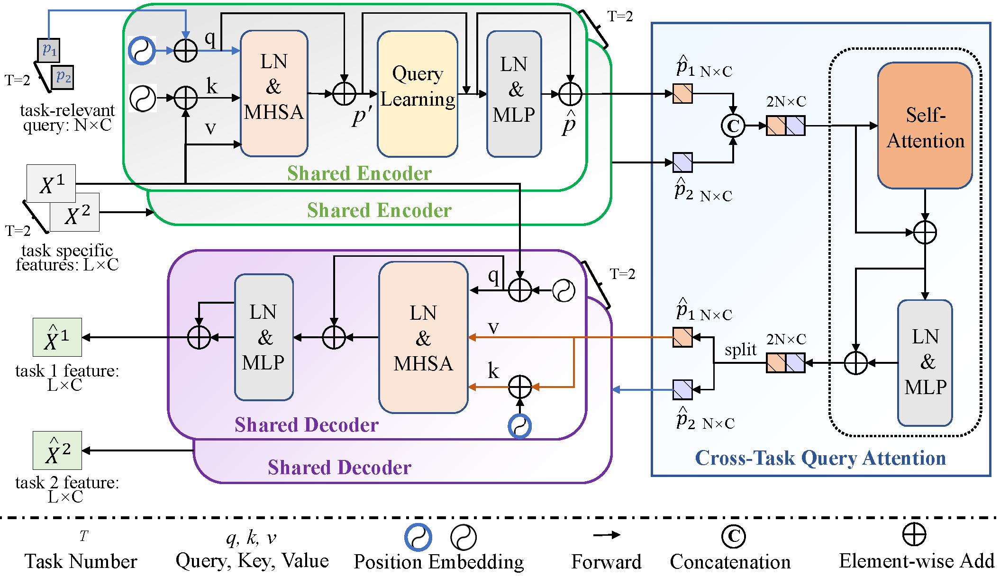

# MQTransformer

This repo is the official implementation of ["MQTransformer"](https://arxiv.org/abs/2205.14354) as well as the follow-ups. It currently includes code and models for the following tasks:


## Updates

***04/04/2023***

`News`: 

1. We release the MQTransformer code and model. 


## Introduction

**MQTransformer** 
Previous multi-task dense prediction studies developed complex pipelines such as multi-modal distillations in multiple stages or searching for task relational contexts for each task. The core insight beyond these methods is to maximize the mutual effects of each task. Inspired by the recent query-based Transformers, we propose a simple pipeline named Multi-Query Transformer (MQTransformer) that is equipped with multiple queries from different tasks to facilitate the reasoning among multiple tasks and simplify the cross-task interaction pipeline. Instead of modeling the dense per-pixel context among different tasks, we seek a task-specific proxy to perform cross-task reasoning via multiple queries where each query encodes the task-related context. The MQTransformer is composed of three key components: shared encoder, cross-task query attention module and shared decoder. We first model each task with a task-relevant query. Then both the task-specific feature output by the feature extractor and the task-relevant query are fed into the shared encoder, thus encoding the task-relevant query from the task-specific feature. Secondly, we design a cross-task query attention module to reason the dependencies among multiple task-relevant queries; this enables the module to only focus on the query-level interaction. Finally, we use a shared decoder to gradually refine the image features with the reasoned query features from different tasks. 

Our MQTransformer achieves strong performance on NYUD-v2 semantic segmentation (`54.84 mIoU` on test), surpassing previous models by a large margin.


<p align="center">Fig.1. An overview of MQTransformer. The MQTransformer represents multiple task-relevant queries to extract task-specific features from different tasks and performs joint multi-task learning. Here, we show an example of task-specific policy learned using our method. Note that the encoder (aqua) and decoder (mauve) are shared in our model. The number of task queries depends on the number of tasks. There are $T$ tasks. The task query first generates uniform initialization weights and then applies these task queries to encode from the corresponding task-specific feature in the shared encoder.</p>



<p align="center">Fig.2. Illustration of the Multi-Query Transformer (MQTransformer)</p>

## Main Results on ImageNet with Pretrained Models

**Our MQTransformer on NYUD-v2 dataset**

| model|backbone|#Params| GFLOPs | SemSeg| Depth | Noemal|Boundary| model checkpopint | log |
| :---: | :---: | :---: | :---: | :---: | :---: | :---: | :---: |:---: |:---: |
| InvPT         | Swin-L |   -M   |  -G    | 51.76 |0.5020 | 19.39 | 77.6 |- | -|
| InvPT         | ViT-L  | 402.1M | 555.57G| 53.56 |0.5183 | 19.04 | 78.1 |- | -|
| MQTransformer | Swin-L | 204.3M | 365.25G| 54.84 |0.5325 | 19.67 | 78.20| [Google Drive](https://drive.google.com/file/d/1ujNkpLYB9TuHe1J0QbWTeC2iDks3MiFv/view?usp=share_link) | [log](https://drive.google.com/file/d/1s1UBcu7CesLZ9_22yCYX4mYOTku4fuXz/view?usp=share_link) |


**Our MQTransformer on PASCAL-Contex dataset**

| model | backbone |  SemSeg | PartSeg | Sal | Normal| Boundary| 
| :---: | :---: | :---: | :---: | :---: | :---: | :---: |
|MQTransformer |ViTAEv2-S| 69.10 | 58.23 | 83.51| 13.73 | 71.30 |
|MQTransformer | Swin-T  | 68.24 | 57.05 | 83.40| 14.56 | 71.10 |
|MQTransformer | Swin-S  | 71.25 | 60.11 | 84.05 | 14.74 | 71.80| 

       
 
## Citing MQTransformer multi-task method

```
@inproceedings{2022MQTransformer,
  title={Multi-Task Learning with Multi-Query Transformer for Dense Prediction},
  author={Xu, Yangyang and Li, Xiangtai and Yuan, Haobo and Yang, Yibo and Zhang, Lefei },
  journal={arXiv preprint arXiv:2205.14354},
  year={2022}
}
```


**Train**

To train MQTransformer model:
```
python ./src/main.py --cfg ./config/t-nyud/swin/swin_large_mqformer_lr0001.yaml --datamodule.data_dir $DATA_DIR --trainer.gpus 8
```

**Evaluation**

- When the training is finished, the boundary predictions are saved in the following directory: ./logger/NYUD_xxx/version_x/edge_preds/ .
- The evaluation of boundary detection use the MATLAB-based [SEISM](https://github.com/jponttuset/seism) repository to obtain the optimal-dataset-scale-F-measure (odsF) scores.


## Acknowledgement
This repository is based [ATRC](https://github.com/brdav/atrc). Thanks to [ATRC](https://github.com/brdav/atrc)!

